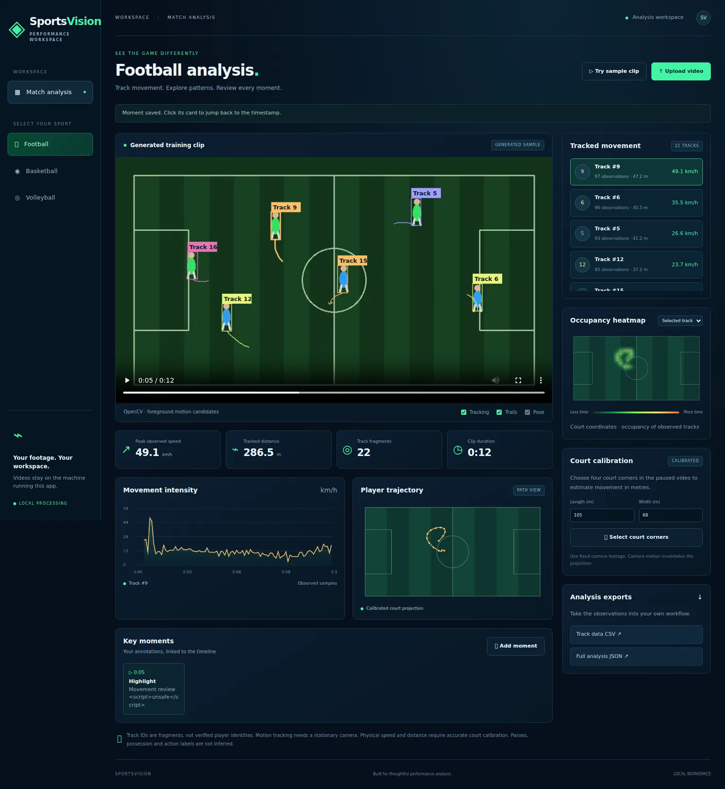

# SportsVision

A local computer vision workspace inspired by sports-analysis dashboards. Upload a fixed-camera clip, inspect tracked motion, review trajectories and occupancy heatmaps, calibrate a court, annotate moments, and export observations. Football, basketball and volleyball presets are included.



[Mobile screenshot](artifacts/mobile.webp)

## Run locally

Requires Python 3.12 and FFmpeg on your PATH.

```bash
cd SportsVision
python -m venv .venv
# macOS / Linux
source .venv/bin/activate
# Windows PowerShell: .venv\Scripts\Activate.ps1
pip install -r requirements.txt
uvicorn app:app --host 127.0.0.1 --port 8000 --workers 1
```

Open http://127.0.0.1:8000. Click **Try sample clip** for original generated test footage, or **Upload video**. The sample runs through the same OpenCV analysis pipeline as uploads; results are not hard-coded.

Use clips up to 200 MB and three minutes. Videos are transcoded into browser-compatible H.264, with audio removed. Processing runs in one background worker with four queue slots. Uploads and results are stored under `data/`, outside version control. Completed results survive restarts; interrupted jobs must be uploaded again. This is a local, single-user application, without authentication. Keep it bound to loopback unless you add access control. Stop the server and remove unwanted job directories from `data/` to reclaim storage. No public hosting is included.

## What works

- Real video decoding and foreground extraction using OpenCV MOG2.
- Hungarian assignment with velocity prediction, a distance gate and track expiry.
- Synchronized bounding boxes and recent image-space trails on browser video playback.
- Track selection, speed chart, trajectories and observed occupancy heatmap.
- Four-corner planar calibration and metric speed/distance estimates.
- Manual pass, shot, goal, foul and highlight annotations, persisted with timestamps.
- CSV observations and full JSON exports, including calibration and detector metadata.
- Responsive dashboard with sports-specific court diagrams.
- Optional local pose-model adapter, including skeleton overlays.

## Calibration and accuracy

Pause on a frame with all four relevant court corners visible. Choose **Select court corners**. Click top-left, top-right, bottom-right and bottom-left in order, enter the actual court dimensions, and apply. The supplied dimensions describe the rectangle you selected, not necessarily the full regulation court. Presets are starting values only. Select corresponding corners of a rectangle lying on the playing surface.

Homography maps normalized image footpoints into the court plane. Distance sums observed segments; speed is segment distance / elapsed video time, multiplied by 3.6 for km/h. Segments with gaps over 0.8 seconds or calibrated speeds above 15 m/s are excluded as potential tracking errors. This filter can also exclude valid motion in an unsuitable scene. There is no claim of benchmarked physical accuracy. Detection jitter, perspective, lens distortion, occlusion, inaccurate corners and camera motion affect results. Heatmaps count observations at the uniform analysis sampling rate (at most 10 Hz).

Uncalibrated analysis shows normalized image coordinates and image units per second. Physical metric cards show N/A. Track fragments are not identified athletes; association can switch IDs or split tracks. Summed distance includes every retained fragment and is not a team workload measurement.

The default detector finds moving foreground objects, including non-players. It is designed for fixed cameras. It does not reliably analyze panning broadcast footage. Team membership, jersey numbers, passes, possession, shot accuracy, pose action classifications and AI coaching are not automatically inferred. Event cards are manual annotations. Sample footage is clearly labeled and is not a real match. Reference images and real-match footage are not redistributed.

## Optional pose model

The default installation requires no pretrained weights or GPU. To enable the adapter, install `ultralytics` in your environment and set `SPORTSVISION_POSE_WEIGHTS` to an existing compatible local COCO pose `.pt` model before starting. Weights are not downloaded automatically by this app. Check the model and Ultralytics license for your intended use. The adapter expects class 0 to mean person and 17 COCO keypoints. Model inference and real footage accuracy require separate validation; pose inference is not needed for the generated sample.

```bash
pip install ultralytics
export SPORTSVISION_POSE_WEIGHTS=/absolute/path/to/your-pose-model.pt
```

PowerShell equivalent: `$env:SPORTSVISION_POSE_WEIGHTS = 'C:\models\pose-model.pt'`.

## Tests

```bash
pip install -r requirements-dev.txt
pytest -q
playwright install chromium
# Keep the app running in a separate terminal, then:
python scripts/browser_check.py
```

Browser checks cover sample analysis, seeking, annotation safety, exports, track selection, calibration, annotation persistence, sports switching and a real upload path. They capture desktop and mobile screenshots under `artifacts/`. An alternate installed Chromium executable can be supplied with `SPORTSVISION_CHROMIUM`. Tests use generated footage, not real sports matches; viewport checks are not physical-device testing.

`requirements-lock.txt` records the complete development environment. `requirements.txt` lists pinned runtime dependencies. Optional Ultralytics dependencies are not included.

## Docker

```bash
docker build -t sportsvision .
docker run --rm -p 127.0.0.1:8000:8000 sportsvision
```

Container data is temporary unless you mount persistent storage with suitable permissions for the `sports` user. Docker execution is a provided deployment option, not part of the local validation.

## API

Interactive documentation is at `/docs`.

| Endpoint | Purpose |
| --- | --- |
| `POST /api/upload` | Multipart video and sport; returns a job ID |
| `POST /api/sample?sport=football` | Generate and analyze a sample |
| `GET /api/jobs/{id}` | Progress and status |
| `GET /api/jobs/{id}/result` | Detections, tracks, metrics and events |
| `GET /api/jobs/{id}/video` | Browser video with HTTP Range support |
| `POST /api/jobs/{id}/analyze` | Reanalyze with normalized corners and dimensions |
| `POST /api/jobs/{id}/events` | Save a manual timestamped event |
| `GET /api/jobs/{id}/export?format=csv` | Export tracks, or JSON when format is omitted |

## Implementation history

This project was built with AI assistance in successive commits: scaffold, analysis backend, dashboard, tests and validation fixes. Imported commits in the parent repository retain the original local commit SHA in their messages. A Git bundle preserves the exact local author metadata and original history.
